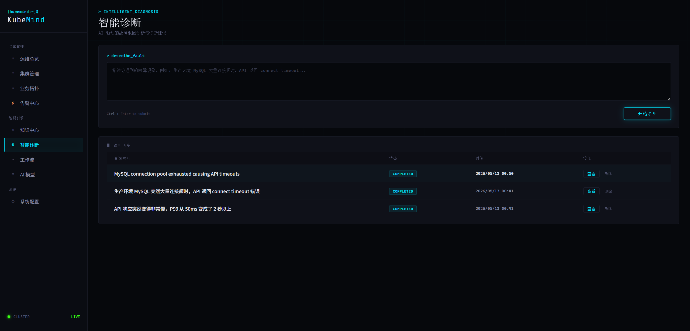

# KubeMind

> AI 驱动的云原生运维工作台 — 知识中心 / 智能诊断 / 告警 / 工作流 / Kubernetes 接入一体化。

KubeMind 通过 RAG (Retrieval-Augmented Generation) 把历史故障案例和应急 Runbook 沉淀为可检索的知识资产，再结合大模型生成结构化的诊断建议，帮助 SRE 与运维工程师快速定位与处置线上问题。

---

## 功能模块

| 模块 | 路由 | 状态 | 说明 |
| --- | --- | --- | --- |
| 知识中心 | `/knowledge` | ✅ MVP | 文档 / 案例 / Runbook 三类知识管理与语义搜索 |
| 智能诊断 | `/diagnosis` | ✅ MVP | 输入故障描述 → Milvus 召回 → DeepSeek 生成根因与排查步骤 |
| AI 模型 | `/models` | ✅ MVP | LLM / Embedding 配置管理与连通性测试 |
| 告警中心 | `/alerts` | ⚙️ 进行中 | 告警 CRUD、等级与状态筛选 |
| 工作流 | `/workflows` | ⚙️ 进行中 | 流程模板与执行记录 |
| 运维总览 | `/dashboard` | ⚙️ 进行中 | 集群与系统运行状态 |
| 集群 | `/clusters` | ⚙️ 进行中 | 通过 Kubernetes API 拉取节点 / Pod 信息 |
| 业务拓扑 | `/topology` | ⏳ 规划中 | 服务依赖图 |
| 系统配置 | `/settings` | ⏳ 规划中 | 平台参数与权限 |

详细路线图见 [plan/develop-plan.md](plan/develop-plan.md)。

---

## 技术栈

**前端** — React 18 · TypeScript · Vite 5 · React Router 7 · Framer Motion · 原生 CSS Variables (深色科技风)

**后端** — FastAPI 0.111 · SQLAlchemy 2.x · Pydantic 2 · SQLite (开发) / PostgreSQL (生产) · pymilvus 2.4

**AI / 数据** — Milvus 向量数据库 · DeepSeek (OpenAI 兼容) · OpenAI 兼容 Embedding API · 内置离线哈希 Embedding (兜底)

**外部基础设施** — Kubernetes API · Prometheus · Loki (规划中)

---

## 目录规划

```text
kubemind/
├── frontend/                          # React + TypeScript + Vite
│   ├── public/
│   ├── src/
│   │   ├── components/                # 通用 UI 组件
│   │   │   ├── Layout.tsx             # 全局布局壳 (Sidebar + Outlet)
│   │   │   └── Sidebar.tsx            # 左侧导航栏
│   │   ├── pages/                     # 页面级组件 (与路由一一对应)
│   │   │   ├── KnowledgeCenter.tsx
│   │   │   ├── Diagnosis.tsx
│   │   │   ├── Alerts.tsx
│   │   │   ├── Workflows.tsx
│   │   │   ├── Models.tsx
│   │   │   ├── Dashboard.tsx
│   │   │   ├── Clusters.tsx
│   │   │   ├── Topology.tsx
│   │   │   └── Settings.tsx
│   │   ├── services/
│   │   │   └── api.ts                 # 统一 fetch 封装 + 各业务接口
│   │   ├── styles/
│   │   │   └── globals.css            # CSS Variables / 深色主题 / 网格背景
│   │   ├── App.tsx                    # 路由表
│   │   └── main.tsx                   # 入口
│   ├── index.html
│   ├── package.json
│   ├── tsconfig.json
│   └── vite.config.ts                 # 含 /api → http://127.0.0.1:8000 代理
│
├── backend/                           # FastAPI 后端
│   ├── app/
│   │   ├── main.py                    # 应用入口、lifespan、CORS、异常注册
│   │   ├── api/
│   │   │   ├── dependencies.py        # 通用依赖 (get_db 等)
│   │   │   └── v1/
│   │   │       ├── router.py          # 路由聚合
│   │   │       └── endpoints/         # 按模块拆分
│   │   │           ├── knowledge.py   # /api/documents
│   │   │           ├── cases.py       # /api/cases
│   │   │           ├── runbooks.py    # /api/runbooks
│   │   │           ├── search.py      # /api/search       (向量检索)
│   │   │           ├── diagnosis.py   # /api/diagnosis    (RAG 诊断)
│   │   │           ├── alerts.py      # /api/alerts
│   │   │           ├── workflows.py   # /api/workflows
│   │   │           ├── model_config.py# /api/models
│   │   │           └── clusters.py    # /api/clusters
│   │   ├── core/                      # 框架级公共能力
│   │   │   ├── config.py              # pydantic-settings (读 app/config/.env)
│   │   │   ├── database.py            # SQLAlchemy engine / SessionLocal / Base
│   │   │   ├── exceptions.py          # AppException 与子类
│   │   │   ├── schemas.py             # 通用响应 Schema (Health / Pagination)
│   │   │   └── security.py            # API Key 校验 (预留 JWT)
│   │   ├── config/                    # 运行时配置
│   │   │   ├── .env                   # 环境变量 (Git 忽略)
│   │   │   ├── .env.example           # 配置样例
│   │   │   └── kubeconfig.yaml        # K8s 连接 (按需)
│   │   ├── models/                    # SQLAlchemy ORM 模型
│   │   │   ├── knowledge.py           # Document
│   │   │   ├── cases.py               # Case
│   │   │   ├── runbooks.py            # Runbook
│   │   │   ├── diagnosis.py           # DiagnosisSession
│   │   │   ├── alerts.py              # Alert
│   │   │   ├── workflows.py           # Workflow
│   │   │   └── model_config.py        # ModelConfig (LLM / Embedding)
│   │   ├── schemas/                   # Pydantic 请求 / 响应 DTO (按模块)
│   │   ├── repositories/              # 数据访问层 (按模块)
│   │   ├── services/                  # 业务逻辑层
│   │   │   ├── knowledge.py / cases.py / runbooks.py
│   │   │   ├── diagnosis.py           # RAG 编排
│   │   │   ├── llm.py                 # OpenAI 兼容聊天接口
│   │   │   ├── embedding.py           # OpenAI / HashEmbeddingProvider
│   │   │   ├── vector_db.py           # Milvus 客户端封装
│   │   │   ├── vector_search.py       # 向量召回 + TF-IDF 兜底
│   │   │   ├── alerts.py / workflows.py / model_config.py
│   │   │   └── k8s.py                 # Kubernetes 客户端
│   │   └── seeds/                     # 初始数据 (按模块)
│   ├── scripts/
│   │   └── reindex_vectors.py         # 全量回填 Milvus (--drop 重建)
│   ├── tests/
│   ├── data/                          # SQLite 数据 (Git 忽略)
│   ├── requirements.txt
│   ├── start.ps1                      # Windows 启动脚本
│   └── README.md
│
├── plan/
│   └── develop-plan.md                # 产品模块、架构图、MVP 路线图
├── docs/                              # 设计文档与截图
├── deploy/                            # 部署脚本与配置
├── draft/                             # 草稿与原型
├── package.json                       # 根工作区脚本 (可选)
├── .env.example
├── .gitignore
└── README.md
```

---

## 快速开始

### 前置依赖

| 依赖 | 推荐版本 | 备注 |
| --- | --- | --- |
| Python | 3.11+ | |
| Node.js | 20+ | 含 npm 或 pnpm |
| Milvus | 2.4+ | Docker `milvusdb/milvus:v2.4.x`，单机即可 |
| Kubernetes | 任意 | 可选，仅 `/clusters` 模块需要 |

### 1. 启动 Milvus (示例)

```bash
docker run -d --name milvus-standalone \
  -p 19530:19530 -p 9091:9091 \
  -e ETCD_USE_EMBED=true \
  -e COMMON_STORAGETYPE=local \
  milvusdb/milvus:v2.4.10 milvus run standalone
```

### 2. 启动后端

```bash
cd backend
pip install -r requirements.txt

# 复制并编辑配置
cp app/config/.env.example app/config/.env
# 至少填好 DEEPSEEK_AUTH_TOKEN 与 VECTOR_DB_HOST

uvicorn app.main:app --reload --port 8000
```

首次启动会自动：建表 → 灌入种子数据 → 初始化 Milvus 集合。

如需把已有种子数据写入 Milvus：

```bash
python -m scripts.reindex_vectors --drop
```

### 3. 启动前端

```bash
cd frontend
npm install
npm run dev
```

打开 `http://127.0.0.1:5173`，默认跳转到知识中心。

---

## 核心 API

| Method | Path | 说明 |
| --- | --- | --- |
| GET / POST / PUT / DELETE | `/api/documents` `/api/cases` `/api/runbooks` | 三类知识 CRUD |
| GET | `/api/search?q=&type=&top_k=` | 语义检索 (Milvus → TF-IDF 兜底) |
| GET / POST / DELETE | `/api/diagnosis` | 诊断会话；POST 触发 RAG + LLM |
| GET / POST / PUT / DELETE | `/api/alerts` `/api/workflows` | 告警与工作流 |
| GET / POST / PUT / DELETE | `/api/models` | LLM / Embedding 配置；`POST /{id}/test` 测连通 |
| GET | `/api/clusters/overview` `/api/clusters/{name}/nodes` `/api/clusters/{name}/pods` | Kubernetes 数据 |
| GET | `/health` | 健康检查 |

完整 OpenAPI 文档：`http://127.0.0.1:8000/docs`。

---

## Embedding 模型选择

KubeMind 支持三档 Embedding，按可用性自动降级：

1. **OpenAI 兼容 API** — 在 `/api/models` 配置 `model_type=embedding`、`is_active=true` 的 OpenAI / BGE / m3e 等。推荐生产使用。
2. **本地哈希 Embedding** (`kubemind-hash-cgram-384`) — 内置离线兜底，384 维确定性哈希，中文友好，无需 API key。默认激活。
3. **TF-IDF 内存检索** — 仅用于 Milvus 不可用时的最后兜底；不写向量库。

切换 Embedding 模型后建议重跑：

```bash
python -m scripts.reindex_vectors --drop
```

---

## 设计风格

深色科技风 (`#0a0e17` / `#00d4ff`)，左侧导航 + 主内容区经典仪表盘布局。CSS Variables 与组件规范见 [.claude/rules/project_rules.md](.claude/rules/project_rules.md)。

## 前端演示

