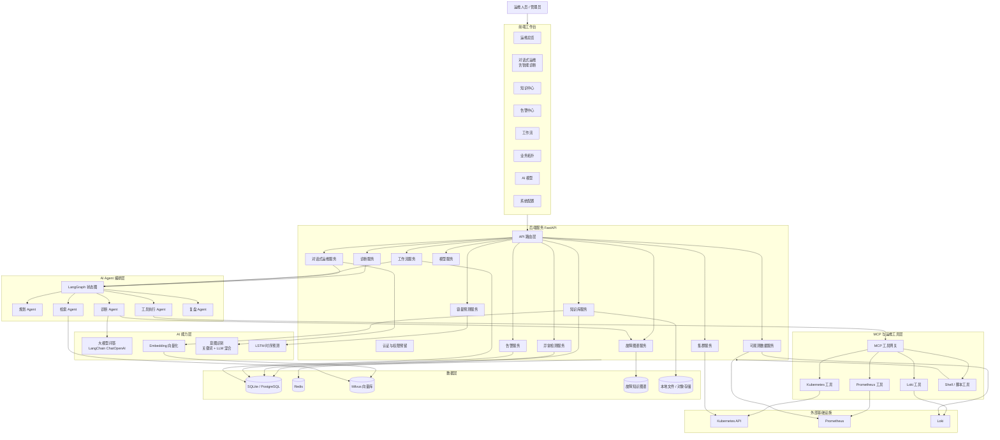
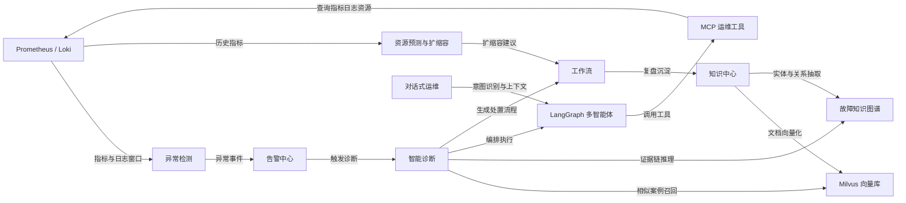
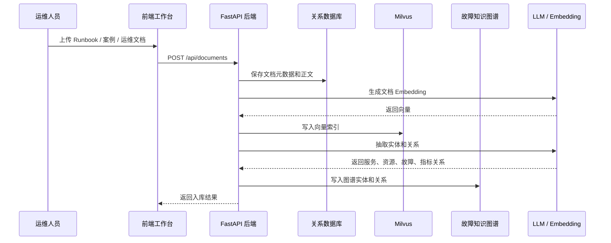
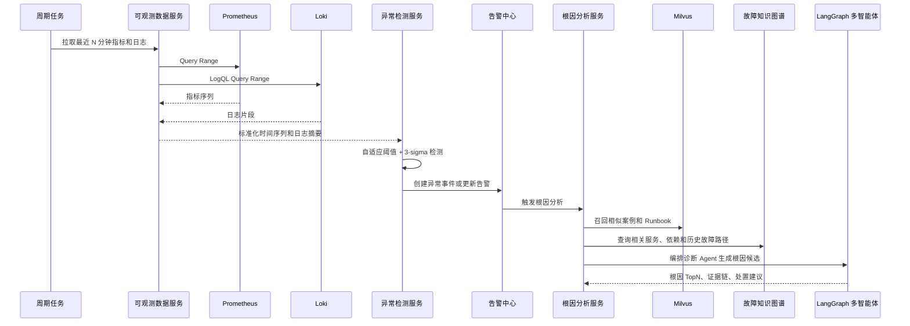
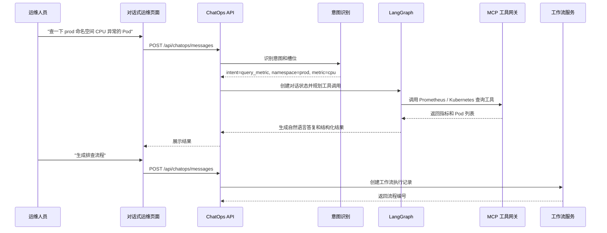
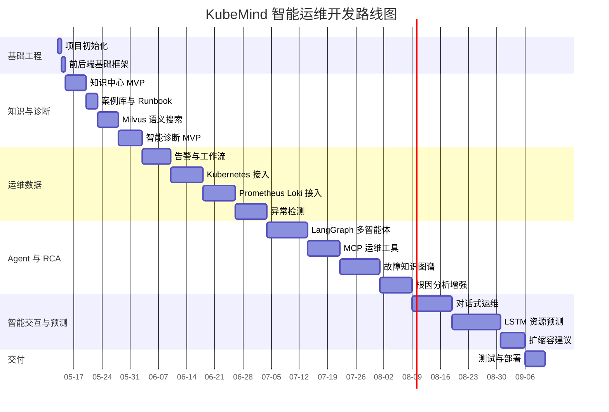

# KubeMind 开发计划

本文档用于规划 KubeMind 的整体架构、模块边界、开发阶段和交付优先级。项目从知识中心、智能诊断、告警中心、工作流和 Kubernetes 运维能力开始建设，后续扩展到多智能体编排、MCP 工具封装、可观测数据接入、异常检测、故障知识图谱、资源预测、智能扩缩容和对话式运维。

## 1. 产品模块总览

| 模块 | 目标 | 核心功能 | 优先级 | MVP 范围 |
| --- | --- | --- | --- | --- |
| 运维总览 | 展示集群和系统运行状态 | 集群状态、节点状态、Pod 状态、资源使用率、健康指标 | P1 | 接入 Kubernetes API，展示核心资源状态 |
| 对话式运维（含智能诊断） | 通过自然语言完成查询、诊断、流程触发和根因分析 | 意图识别、槽位抽取、多轮上下文、工具调用、Agent 编排、故障诊断 | P0 | 支持查询集群、查询告警、发起诊断、检索 Runbook，输出根因和处置计划 |
| 知识中心 | 沉淀可复用运维知识 | 案例库、Runbook、文档管理、语义搜索 | P0 | 文档管理、Runbook 列表、搜索、上传、删除 |
| 告警中心 | 统一管理监控告警 | 告警列表、等级筛选、状态跟踪、关联诊断 | P1 | 支持手动创建、Mock 告警和 Prometheus 告警接入预留 |
| 工作流 | 标准化故障处理流程 | 流程模板、节点状态、人工确认、执行记录 | P1 | 流程记录、状态流转、诊断联动 |
| 多智能体工作流 | 让不同运维 Agent 协作完成诊断与处置 | LangGraph 状态图、Agent 分工、工具调用、人工确认 | P1 | 实现诊断、检索、执行、复盘四类 Agent 的最小闭环 |
| MCP 与运维工具 | 封装 Kubernetes、Prometheus、Loki、Shell 等工具能力 | MCP Server、工具注册、权限控制、审计日志 | P1 | 先封装只读查询工具，变更类工具必须人工确认 |
| 可观测数据源 | 接入指标、日志、事件和告警数据 | Prometheus Query API、Loki LogQL、Kubernetes Events | P1 | 支持按服务、命名空间、时间窗口拉取数据 |
| 异常检测 | 自动发现指标异常并生成诊断上下文 | 自适应阈值、滑动窗口、3-sigma、异常评分 | P1 | 对 CPU、内存、磁盘、网络、错误率做基础检测 |
| 故障知识图谱 | 建模资源、服务、告警、指标、日志、案例之间的关系 | 实体抽取、关系构建、图查询、影响面分析 | P2 | 用关系表先落地，后续可迁移 Neo4j |
| 根因分析 | 结合图谱和向量库输出根因候选 | Milvus 相似案例召回、图谱路径推理、证据聚合 | P1 | 输出根因 TopN、证据链和推荐 Runbook |
| 资源预测与扩缩容 | 预测资源需求并给出扩缩容建议 | LSTM 时序预测、容量水位、HPA 建议、变更审批 | P2 | 先输出预测和建议，不自动执行变更 |
| 业务拓扑 | 展示服务依赖与影响范围 | 服务关系、实例关系、告警影响节点高亮 | P3 | 后续接 Kubernetes Service / Deployment / Pod |
| AI 模型 | 管理模型和 AI 能力配置 | LLM 配置、Embedding 配置、模型测试、调用记录 | P1 | 实现配置存储、激活状态和连接测试 |
| 系统配置 | 管理平台基础参数 | 用户配置、外部服务地址、系统参数、权限预留 | P2 | 先实现环境配置和基础设置页面 |

## 2. 整体架构图



## 3. 核心模块关系图



## 4. 数据流设计

### 4.1 知识入库与语义检索



### 4.2 异常检测到根因分析



### 4.3 对话式运维



## 5. 后端服务拆分

| 服务 | 当前/建议目录 | 职责 | 主要接口 |
| --- | --- | --- | --- |
| API 入口 | `backend/app/main.py` | 创建 FastAPI 应用、注册路由、中间件、启动初始化 | `/health` |
| 知识库服务 | `backend/app/services/knowledge.py`、`backend/app/services/runbooks.py`、`backend/app/services/cases.py` | 文档、案例、Runbook CRUD，文本抽取，索引入库 | `/api/documents`、`/api/cases`、`/api/runbooks` |
| 诊断服务 | `backend/app/services/diagnosis.py` | 故障输入解析、相似案例召回、诊断报告生成 | `/api/diagnosis` |
| 告警服务 | `backend/app/services/alerts.py` | 告警管理、状态流转、关联诊断 | `/api/alerts` |
| 工作流服务 | `backend/app/services/workflows.py` | 流程模板、执行实例、节点状态 | `/api/workflows` |
| 集群服务 | `backend/app/services/k8s.py` | Kubernetes 集群、节点、Pod、事件查询 | `/api/clusters` |
| 可观测数据服务 | `backend/app/services/observability.py` | Prometheus、Loki 查询封装，统一时间窗口和标签过滤 | `/api/observability/*` |
| 异常检测服务 | `backend/app/services/anomaly.py` | 自适应阈值、3-sigma、异常事件生成 | `/api/anomalies` |
| 多智能体服务 | `backend/app/agents/` | LangChain 工具封装、LangGraph 状态图、Agent 节点 | `/api/agents/runs` |
| MCP 工具服务 | `backend/app/tools/`、`backend/app/mcp/` | MCP Server、工具注册、权限校验、审计记录 | `/api/tools/*` |
| 图谱服务 | `backend/app/services/knowledge_graph.py` | 实体关系抽取、图谱写入、影响路径查询 | `/api/graph/*` |
| 根因分析服务 | `backend/app/services/root_cause.py` | 聚合向量召回、图谱路径、异常证据和 Agent 输出 | `/api/root-cause` |
| 容量预测服务 | `backend/app/services/capacity.py` | 指标样本构造、LSTM 预测、扩缩容建议 | `/api/capacity/*` |
| 对话式运维服务 | `backend/app/services/chatops.py` | 意图识别、槽位抽取、上下文管理、工具调用 | `/api/chatops/*` |
| 模型服务 | `backend/app/services/model_config.py`、`backend/app/services/llm.py`、`backend/app/services/embedding.py` | LLM、Embedding、模型连接测试 | `/api/models` |
| 公共能力 | `backend/app/core/` | 配置、日志、数据库、异常处理、权限预留 | - |

## 6. 前端页面拆分

| 页面 | 路由建议 | 主要组件 | MVP 要求 |
| --- | --- | --- | --- |
| 运维总览 | `/dashboard` | 集群健康卡片、资源图表、异常趋势、告警概览 | 展示真实或 Mock 集群状态和异常摘要 |
| 集群管理 | `/clusters` | 集群列表、节点表、Pod 表、事件列表 | 支持查看 Kubernetes 资源状态 |
| 对话式运维（含智能诊断） | `/chatops` | 对话窗口、故障诊断输入、结构化结果卡片、Agent 执行轨迹、根因候选、处置计划 | 支持查询、诊断、Runbook 检索和流程触发（原独立 `/diagnosis` 已合并） |
| 知识中心 | `/knowledge` | Tab、筛选器、上传按钮、文档表格、图谱入口 | 优先完成文档、案例、Runbook 管理 |
| 告警中心 | `/alerts` | 告警表格、等级筛选、详情抽屉、异常检测标签 | 展示 Mock 告警和 Prometheus 告警接入结果 |
| 工作流 | `/workflows` | 流程列表、状态标签、执行详情、人工确认 | 展示基础流程记录，支持诊断生成流程 |
| 业务拓扑 | `/topology` | 拓扑画布、节点详情、影响面高亮 | 后续实现服务依赖图 |
| AI 模型 | `/models` | 模型配置表单、连接测试、激活状态 | 保存配置并测试连接 |
| 系统配置 | `/settings` | 数据源配置、权限配置、工具安全策略 | 后续实现 |

## 7. 智能运维专项设计

### 7.1 LangChain 与 LangGraph 多智能体工作流

| Agent | 输入 | 输出 | 工具权限 | 说明 |
| --- | --- | --- | --- | --- |
| PlannerAgent | 用户问题、告警、异常事件 | 执行计划、所需数据源、风险级别 | 只读 | 决定是否需要查询指标、日志、图谱、向量库 |
| RetrieverAgent | 检索计划、关键词、实体 | 相似案例、Runbook、相关文档 | Milvus、SQL | 负责 RAG 召回和证据整理 |
| ObservabilityAgent | 服务名、命名空间、时间窗口 | 指标摘要、日志摘要、事件摘要 | Prometheus、Loki、Kubernetes 只读 | 给诊断提供客观上下文 |
| DiagnosisAgent | 告警、异常、知识、观测数据 | 根因候选、置信度、证据链 | LLM、图谱查询 | 输出结构化 RCA |
| ToolAgent | 待执行工具调用 | 工具执行结果 | MCP 工具 | 默认只读；变更类工具需要人工确认 |
| RemediationAgent | 根因和 Runbook | 处置步骤、风险提示、回滚方案 | 工作流、脚本工具 | 先生成建议，不直接执行高风险动作 |
| ReviewAgent | 诊断过程、执行结果 | 复盘摘要、知识入库草稿 | SQL、知识库 | 将处理记录沉淀为案例 |

LangGraph 状态建议：

```python
class OpsGraphState(TypedDict):
    session_id: str
    user_query: str
    intent: str
    entities: dict[str, str]
    time_range: dict[str, str]
    evidence: list[dict]
    tool_calls: list[dict]
    root_causes: list[dict]
    remediation_plan: list[dict]
    requires_human_approval: bool
```

### 7.2 MCP 与常用运维工具封装

| 工具类别 | 工具示例 | 风险等级 | 首期策略 |
| --- | --- | --- | --- |
| Kubernetes 只读 | `list_pods`、`get_pod_events`、`describe_node`、`list_deployments` | 低 | 允许 Agent 直接调用并记录审计 |
| Prometheus 查询 | `query_promql`、`query_range`、`get_alerts` | 低 | 限制查询时间范围和最大返回点数 |
| Loki 查询 | `query_logs`、`query_log_context` | 中 | 限制 namespace、时间范围和返回行数 |
| Shell 只读 | `df -h`、`free -m`、`top`、`netstat` | 中 | 只允许白名单命令 |
| Kubernetes 变更 | `scale_deployment`、`restart_pod`、`cordon_node` | 高 | 必须人工确认，默认不在 MVP 自动执行 |
| 脚本执行 | Runbook 自动化脚本 | 高 | 需要审批、超时控制和回滚说明 |

### 7.3 Prometheus + Loki 数据源

| 数据源 | 接入方式 | 核心能力 | 配置项 |
| --- | --- | --- | --- |
| Prometheus | HTTP Query API | 即时查询、范围查询、告警规则查询 | `PROMETHEUS_BASE_URL`、`PROMETHEUS_TIMEOUT_SECONDS` |
| Loki | HTTP Query Range API | LogQL 查询、日志上下文、错误日志摘要 | `LOKI_BASE_URL`、`LOKI_TIMEOUT_SECONDS` |
| Kubernetes | Python Kubernetes Client | 集群、节点、Pod、事件、Deployment 查询 | `KUBECONFIG_PATH` |

首期内置 PromQL：

```text
CPU 使用率: 100 * (1 - avg by(instance)(rate(node_cpu_seconds_total{mode="idle"}[5m])))
内存使用率: 100 * (1 - node_memory_MemAvailable_bytes / node_memory_MemTotal_bytes)
磁盘使用率: 100 * (1 - node_filesystem_avail_bytes / node_filesystem_size_bytes)
Pod 重启次数: increase(kube_pod_container_status_restarts_total[10m])
HTTP 错误率: sum(rate(http_requests_total{status=~"5.."}[5m])) / sum(rate(http_requests_total[5m]))
```

### 7.4 自适应阈值 + 3-sigma 异常检测

检测流程：

1. 按指标、资源、命名空间和服务维度建立滑动窗口。
2. 清洗空值、异常采样点和明显错误值。
3. 计算窗口均值 `mean`、标准差 `std`、分位数 `p95`、动态基线 `baseline`。
4. 使用 `upper = mean + 3 * std`、`lower = mean - 3 * std` 生成 3-sigma 边界。
5. 根据业务特征叠加自适应阈值，例如 CPU 持续超过历史 p95 且超过 80%。
6. 生成异常评分：偏离程度、持续时间、影响资源数量、告警等级。
7. 将异常事件写入告警中心，并作为 RCA 输入。

异常事件结构建议：

```json
{
  "metric_name": "pod_cpu_usage_percent",
  "resource_type": "pod",
  "resource_name": "api-server-7f9d",
  "namespace": "prod",
  "window": "15m",
  "value": 92.4,
  "baseline": 55.2,
  "upper_bound": 81.7,
  "score": 0.91,
  "severity": "critical",
  "evidence": ["CPU 使用率连续 8 分钟超过动态上界"]
}
```

### 7.5 故障知识图谱 + Milvus 根因分析

图谱实体：

| 实体 | 示例 | 来源 |
| --- | --- | --- |
| Service | `payment-api` | Kubernetes Service、文档、日志 |
| Workload | `payment-api Deployment` | Kubernetes API |
| Pod | `payment-api-xxx` | Kubernetes API |
| Node | `node-1` | Kubernetes API |
| Metric | `cpu_usage_percent` | Prometheus |
| Alert | `PodRestartHigh` | Alertmanager / 告警中心 |
| LogPattern | `connection timeout` | Loki 日志聚类 |
| Incident | `2026-05-13 payment timeout` | 案例库 |
| Runbook | `高 CPU 排查手册` | 知识中心 |

图谱关系：

| 关系 | 含义 |
| --- | --- |
| `DEPENDS_ON` | 服务依赖服务或组件 |
| `RUNS_ON` | Pod 运行在节点上 |
| `OWNS` | Deployment 管理 Pod |
| `TRIGGERS` | 指标或日志模式触发告警 |
| `SIMILAR_TO` | 当前故障与历史案例相似 |
| `RESOLVED_BY` | 故障可由某个 Runbook 处理 |
| `AFFECTS` | 节点、Pod、服务之间的影响关系 |

RCA 排序特征：

| 特征 | 权重建议 |
| --- | --- |
| 当前异常评分 | 30% |
| 图谱路径距离 | 20% |
| Milvus 相似案例分数 | 20% |
| 告警等级和持续时间 | 15% |
| 影响面大小 | 10% |
| 最近变更关联 | 5% |

### 7.6 LSTM 资源预测与智能扩缩容

首期目标是“预测 + 建议”，不直接自动扩缩容。预测对象包括 Deployment 的 CPU、内存、QPS 和 Pod 副本数。

数据集构造：

| 字段 | 来源 | 说明 |
| --- | --- | --- |
| `timestamp` | Prometheus | 采样时间 |
| `namespace` | Kubernetes 标签 | 命名空间 |
| `workload` | Kubernetes Deployment | 工作负载 |
| `cpu_usage` | Prometheus | CPU 使用量或使用率 |
| `memory_usage` | Prometheus | 内存使用量或使用率 |
| `request_rate` | 应用指标 | 请求速率 |
| `error_rate` | 应用指标 | 错误率 |
| `replicas` | Kubernetes API | 当前副本数 |

预测输出：

```json
{
  "namespace": "prod",
  "workload": "payment-api",
  "horizon_minutes": 60,
  "predicted_cpu_percent": 86.3,
  "predicted_memory_percent": 73.1,
  "recommended_replicas": 6,
  "current_replicas": 3,
  "reason": "未来 60 分钟 CPU 预计持续超过 80%",
  "action": "scale_out",
  "requires_approval": true
}
```

### 7.7 对话式运维与意图识别

意图识别采用**混合策略**：关键词匹配优先（零延迟、零成本），未命中时调用 LLM 分类（通过 LangChain ChatOpenAI）。

LLM 层使用 `langchain-openai` 的 `ChatOpenAI`，支持：
- 动态模型切换（从 DB `model_configs` 表读取 endpoint/api_key/model_name）
- 内置重试（max_retries=2）和超时（timeout=60s）
- 流式输出（`.stream()` 方法，用于 ChatOps SSE 端点）
- 兼容所有 OpenAI 协议的 provider（DeepSeek、OpenAI、Azure、本地 Ollama 等）

首期意图集合：

| 意图 | 示例 | 必要槽位 | 动作 |
| --- | --- | --- | --- |
| `general_chat` | “你是什么模型”、”你能做什么” | 无 | LLM 自由回复，不触发运维操作 |
| `query_cluster` | “查看集群状态” | cluster 可选 | 调用集群概览 |
| `query_metric` | “查 prod 的 CPU” | namespace、metric | 调用 Prometheus |
| `query_logs` | “看 payment-api 最近错误日志” | service、time_range | 调用 Loki |
| `diagnose_issue` | “帮我分析支付服务超时” | issue_text | 触发 RCA |
| `search_runbook` | “找一下磁盘满的处理手册” | query | 检索知识库 |
| `create_workflow` | “生成排查流程” | diagnosis_id 或 issue_text | 创建工作流 |
| `capacity_forecast` | “预测 api 服务今晚资源够不够” | workload、horizon | 调用容量预测 |
| `scale_recommendation` | “是否需要扩容 payment-api” | workload | 生成扩缩容建议 |

多轮上下文需要保存：

```json
{
  "session_id": "chat-001",
  "last_intent": "query_metric",
  "entities": {
    "namespace": "prod",
    "workload": "payment-api"
  },
  "last_tool_result_id": "tool-result-123",
  "pending_workflow_id": null
}
```

## 8. 开发阶段

| 阶段 | 时间 | 目标 | 交付物 | 验收标准 |
| --- | --- | --- | --- | --- |
| 阶段 0 | 0.5-1 天 | 项目初始化 | 前后端目录、启动脚本、基础配置 | 前后端可启动 |
| 阶段 1 | 3-5 天 | 知识中心 MVP | 文档管理页面、CRUD API、SQLite 数据 | 可上传、查询、筛选、删除文档 |
| 阶段 2 | 2-3 天 | 案例库与 Runbook | 案例、Runbook 数据模型和页面 | 三类知识都可管理 |
| 阶段 3 | 3-5 天 | 语义搜索 | Embedding 接口、Milvus 索引、相似文档召回 | 自然语言能召回相关 Runbook |
| 阶段 4 | 4-6 天 | 智能诊断 MVP（已合并至对话式运维） | 诊断输入、RAG 检索、结构化报告 | 能输出根因候选和排查建议；后续合并到阶段 12 |
| 阶段 5 | 5-7 天 | 告警与工作流 | 告警列表、流程状态、诊断联动 | 告警可触发诊断并生成流程记录 |
| 阶段 6 | 5-8 天 | Kubernetes 接入 | 集群状态、节点、Pod、事件 | 可读取真实或 Mock 集群数据 |
| 阶段 7 | 4-6 天 | DeepSeek / 模型配置完善 | 模型配置、连接测试、LLM 调用抽象 | 诊断可使用真实模型输出 |
| 阶段 8 | 5-8 天 | Prometheus + Loki 接入 | 指标查询、日志查询、数据源配置 | 可按服务和时间窗口查询指标日志 |
| 阶段 9 | 5-8 天 | 异常检测 | 自适应阈值、3-sigma、异常事件 | CPU/内存/磁盘/网络异常可生成告警 |
| 阶段 10 | 7-10 天 | LangGraph 多智能体 + MCP 工具 | Agent 状态图、工具注册、只读工具调用 | 对一次故障可自动规划并查询证据 |
| 阶段 11 | 7-10 天 | 故障知识图谱 + RCA | 实体关系抽取、图谱查询、RCA 排序 | 诊断结果包含根因 TopN 和证据链 |
| 阶段 12 | 7-10 天 | 对话式运维（含智能诊断合并） | 意图识别、多轮上下文、工具调用轨迹、故障诊断 | 支持查询、诊断、检索和流程创建；前端 /diagnosis 已合并至 /chatops |
| 阶段 13 | 8-12 天 | LSTM 预测与扩缩容建议 | 训练样本、预测接口、建议生成 | 对工作负载输出未来资源需求和副本建议 |
| 阶段 14 | 3-5 天 | 工程化部署 | Docker、Compose、测试、日志、配置文档 | 一条命令启动完整环境 |

## 9. 开发路线图



## 10. 推荐目录结构

```text
kubemind/
├── frontend/
│   ├── src/
│   │   ├── components/          # 通用 UI 组件
│   │   ├── pages/               # Dashboard / Diagnosis / ChatOps / Knowledge 等页面
│   │   ├── services/            # API Client 与类型定义
│   │   ├── styles/              # 全局样式
│   │   └── main.tsx
│   ├── package.json
│   └── vite.config.ts
├── backend/
│   ├── app/
│   │   ├── agents/              # LangChain / LangGraph Agent 节点与状态图
│   │   ├── api/
│   │   │   └── v1/
│   │   │       ├── endpoints/   # REST API 入口
│   │   │       └── router.py
│   │   ├── core/                # 配置、数据库、异常、安全预留
│   │   ├── mcp/                 # MCP Server、协议适配、工具暴露
│   │   ├── models/              # SQLAlchemy 数据模型
│   │   ├── repositories/        # 数据访问层
│   │   ├── schemas/             # Pydantic Schema
│   │   ├── services/            # 业务服务
│   │   ├── tools/               # Kubernetes / Prometheus / Loki / Shell 工具封装
│   │   ├── ml/                  # LSTM 训练、推理、特征工程
│   │   ├── seeds/               # 初始化演示数据
│   │   └── main.py
│   ├── scripts/
│   │   ├── reindex_vectors.py   # Milvus 重建索引
│   │   └── train_capacity.py    # 资源预测模型训练脚本
│   ├── tests/
│   └── requirements.txt
├── deploy/
│   ├── run.txt
│   └── docker-compose.yml
├── docs/
├── plan/
│   ├── develop-plan.md
│   └── phase6.md
├── README.md
└── package.json
```

## 11. 近期优先任务

| 顺序 | 任务 | 说明 | 结果 |
| --- | --- | --- | --- |
| 1 | 恢复并整理 README | 保证目录规划同时覆盖前端和后端 | README 可作为项目入口文档 |
| 2 | 完成 Phase 6 | DeepSeek 集成、Kubernetes 接入、Dashboard 和 Clusters 页面升级 | 模型和集群页面可用 |
| 3 | 增加数据源配置 | 支持 Prometheus、Loki、Kubeconfig 配置 | 后端可读取外部观测数据 |
| 4 | 实现可观测数据服务 | 封装 PromQL、LogQL 查询和统一返回格式 | 诊断可引用指标与日志 |
| 5 | 实现异常检测服务 | 自适应阈值 + 3-sigma，生成异常事件 | 告警中心可展示异常来源 |
| 6 | 设计 Agent 状态图 | 用 LangGraph 串联规划、检索、观测、诊断、复盘 | 智能诊断流程可追踪 |
| 7 | 封装 MCP 工具 | 先提供 Kubernetes、Prometheus、Loki 只读工具 | Agent 能安全调用运维工具 |
| 8 | 建立故障知识图谱最小模型 | 先用关系型表表达实体和关系 | RCA 可查询服务影响路径 |
| 9 | 增强根因分析 | 聚合异常、图谱、Milvus、Runbook 输出证据链 | 诊断结果从建议升级为 RCA |
| 10 | 开发对话式运维 | 意图识别、多轮上下文、工具调用轨迹 | 用户可通过自然语言完成查询和诊断 |
| 11 | 增加 LSTM 预测接口 | 先离线训练，在线推理输出资源预测 | 可生成扩缩容建议 |

## 12. 验收标准

| 能力 | 验收方式 |
| --- | --- |
| 多智能体工作流 | 提交一次故障诊断后，系统能展示 Agent 执行步骤、工具调用、检索证据和最终结论 |
| MCP 工具封装 | Agent 可调用 Kubernetes、Prometheus、Loki 只读工具，所有调用有审计记录 |
| Prometheus + Loki 接入 | 输入服务名和时间窗口后，可返回指标序列、日志片段和摘要 |
| 异常检测 | 对模拟 CPU/内存/磁盘异常数据运行检测后，可生成异常事件和告警 |
| 知识图谱 + Milvus RCA | 对一个故障输入，结果包含相似案例、图谱影响路径、根因 TopN 和推荐 Runbook |
| LSTM 资源预测 | 输入历史指标后，接口返回未来 30/60 分钟资源预测和副本建议 |
| 对话式运维 | 支持“查指标”“看日志”“分析故障”“找 Runbook”“生成流程”等自然语言指令 |
| 安全控制 | 变更类操作默认只生成建议，不自动执行；需要人工确认和审计记录 |

## 13. 风险与约束

| 风险 | 影响 | 处理策略 |
| --- | --- | --- |
| 外部数据源不可用 | 诊断缺少实时证据 | 保留 Mock 数据和降级提示 |
| LLM 输出不稳定 | RCA 结论不可复现 | 结构化 Prompt、证据引用、规则校验、置信度评分 |
| 工具调用有变更风险 | 可能影响生产环境 | 首期只读；变更类动作必须人工确认 |
| 图谱建设成本高 | 短期难以完整覆盖所有关系 | 先用 Kubernetes 资源关系、告警关系和案例关系构建最小图谱 |
| LSTM 数据量不足 | 预测准确率低 | 先以建议和趋势展示为主，不自动扩缩容 |
| PromQL / LogQL 结果过大 | 接口慢或页面卡顿 | 限制时间范围、分页、采样和最大返回数量 |
