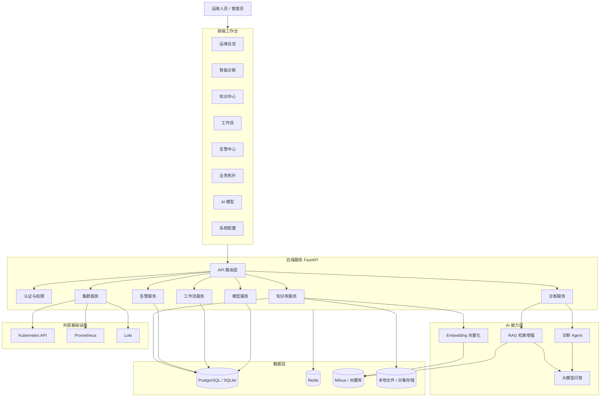
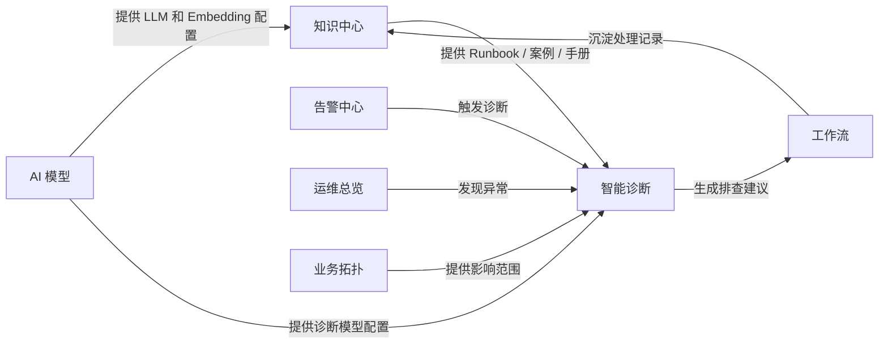
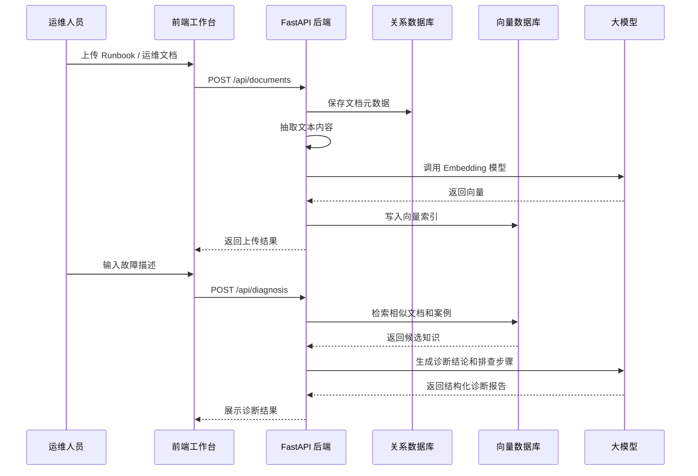
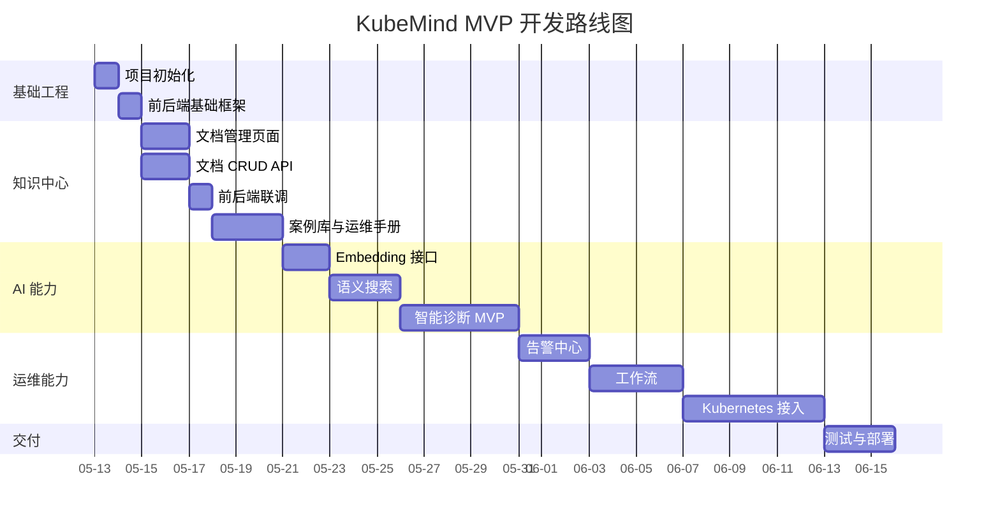

# KubeMind 开发计划

本文档用于规划 KubeMind的整体架构、模块边界、开发阶段和交付优先级。当前项目从知识中心 MVP 开始建设，再逐步扩展智能诊断、告警中心、工作流、业务拓扑和 Kubernetes 运维能力。

## 1. 产品模块总览

| 模块 | 目标 | 核心功能 | 优先级 | MVP 范围 |
| --- | --- | --- | --- | --- |
| 运维总览 | 展示集群和系统运行状态 | 集群状态、节点状态、Pod 状态、资源使用率、健康指标 | P2 | 先使用 Mock 数据，后续接 Kubernetes API |
| 智能诊断 | 辅助定位故障根因 | 故障描述输入、日志分析、指标摘要、相似案例召回、排查建议 | P1 | 基于知识库和规则生成结构化诊断结果 |
| 知识中心 | 沉淀可复用运维知识 | 案例库、运维手册、文档管理、语义搜索 | P0 | 优先实现文档管理、Runbook 列表、搜索、上传、删除 |
| 工作流 | 标准化故障处理流程 | 流程模板、节点状态、人工确认、执行记录 | P2 | 先实现流程记录和状态流转 |
| 告警中心 | 统一管理监控告警 | 告警列表、等级筛选、状态跟踪、关联诊断 | P2 | 先支持手动创建和 Mock 告警 |
| 业务拓扑 | 展示服务依赖与影响范围 | 服务关系、实例关系、告警影响节点高亮 | P3 | 后续接 Kubernetes Service / Deployment / Pod |
| AI 模型 | 管理模型和 AI 能力配置 | LLM 配置、Embedding 配置、模型测试、调用记录 | P1 | 先实现配置存储和接口抽象 |
| 系统配置 | 管理平台基础参数 | 用户配置、外部服务地址、系统参数、权限预留 | P2 | 先实现环境配置和基础设置页面 |

## 2. 整体架构图



## 3. 核心模块关系图



## 4. 数据流设计



## 5. 后端服务拆分

| 服务 | 目录建议 | 职责 | 主要接口 |
| --- | --- | --- | --- |
| API 入口 | `backend/app/main.py` | 创建 FastAPI 应用、注册路由、中间件 | `/health` |
| 知识库服务 | `backend/app/modules/knowledge/` | 文档、案例、手册 CRUD，文本抽取，索引入库 | `/api/documents`、`/api/cases`、`/api/runbooks` |
| 诊断服务 | `backend/app/modules/diagnosis/` | 故障输入解析、相似案例召回、诊断报告生成 | `/api/diagnosis` |
| 告警服务 | `backend/app/modules/alerts/` | 告警管理、状态流转、关联诊断 | `/api/alerts` |
| 工作流服务 | `backend/app/modules/workflows/` | 流程模板、执行实例、节点状态 | `/api/workflows` |
| 集群服务 | `backend/app/modules/clusters/` | Kubernetes、Prometheus、Loki 数据接入 | `/api/clusters` |
| 模型服务 | `backend/app/modules/models/` | LLM、Embedding、向量库配置 | `/api/models` |
| 公共能力 | `backend/app/core/` | 配置、日志、数据库、异常处理、权限预留 | - |

## 6. 前端页面拆分

| 页面 | 路由建议 | 主要组件 | MVP 要求 |
| --- | --- | --- | --- |
| 运维总览 | `/dashboard` | 指标卡片、资源图表、状态列表 | 使用 Mock 数据展示布局 |
| 智能诊断 | `/diagnosis` | 输入表单、诊断结果、推荐 Runbook | 支持提交故障描述并展示结果 |
| 知识中心 | `/knowledge` | Tab、筛选器、上传按钮、文档表格 | 优先完成，视觉对齐截图 |
| 工作流 | `/workflows` | 流程列表、状态标签、执行详情 | 展示基础流程记录 |
| 告警中心 | `/alerts` | 告警表格、等级筛选、详情抽屉 | 展示 Mock 告警 |
| 业务拓扑 | `/topology` | 拓扑画布、节点详情 | 后续实现 |
| AI 模型 | `/models` | 模型配置表单、连接测试 | 保存配置即可 |
| 系统配置 | `/settings` | 基础参数、用户配置 | 后续实现 |

## 7. MVP 开发阶段

| 阶段 | 时间 | 目标 | 交付物 | 验收标准 |
| --- | --- | --- | --- | --- |
| 阶段 0 | 0.5-1 天 | 项目初始化 | 前后端目录、启动脚本、基础配置 | 前后端可启动 |
| 阶段 1 | 3-5 天 | 知识中心 MVP | 文档管理页面、CRUD API、Mock/SQLite 数据 | 可上传、查询、筛选、删除文档 |
| 阶段 2 | 2-3 天 | 案例库与运维手册 | 案例、Runbook、手册数据模型和页面 | 三类知识都可管理 |
| 阶段 3 | 3-5 天 | 语义搜索 | Embedding 接口、向量索引、相似文档召回 | 自然语言能召回相关 Runbook |
| 阶段 4 | 4-6 天 | 智能诊断 MVP | 诊断输入、RAG 检索、诊断报告 | 能输出根因候选和排查建议 |
| 阶段 5 | 5-7 天 | 告警与工作流 | 告警列表、流程状态、诊断联动 | 告警可触发诊断并生成流程记录 |
| 阶段 6 | 5-8 天 | Kubernetes 接入 | 集群状态、Pod 状态、基础指标 | 可读取真实或 Mock 集群数据 |
| 阶段 7 | 2-4 天 | 工程化部署 | Docker、Compose、测试、日志 | 一条命令启动完整环境 |

## 8. 开发路线图



## 9. 推荐目录结构

```text
kubemind/
├── frontend/
│   ├── src/
│   │   ├── app/
│   │   ├── components/
│   │   ├── pages/
│   │   ├── services/
│   │   └── styles/
│   ├── package.json
│   └── vite.config.ts
├── backend/
│   ├── app/
│   │   ├── core/
│   │   ├── modules/
│   │   │   ├── knowledge/
│   │   │   ├── diagnosis/
│   │   │   ├── alerts/
│   │   │   ├── workflows/
│   │   │   ├── clusters/
│   │   │   └── models/
│   │   └── main.py
│   ├── tests/
│   └── requirements.txt
├── docs/
├── deploy/
├── 111.jpg
├── README.md
└── 开发计划.md
```

## 10. 近期优先任务

| 顺序 | 任务 | 说明 | 结果 |
| --- | --- | --- | --- |
| 1 | 初始化前端工程 | 使用 React + TypeScript + Vite | 能打开基础页面 |
| 2 | 搭建工作台布局 | 参考截图实现侧边栏、顶部区域、主内容区 | 页面结构接近设计图 |
| 3 | 实现知识中心页面 | 完成 Tab、搜索、筛选、表格、上传按钮 | 文档管理可交互 |
| 4 | 初始化后端工程 | 使用 FastAPI 组织模块 | `/health` 可访问 |
| 5 | 实现文档 CRUD | 支持列表、创建、删除、搜索 | 前后端可联调 |
| 6 | 增加演示数据 | 内置 MySQL、磁盘、网络、内存类 Runbook | 页面有真实运维语义 |
| 7 | 补充语义搜索接口 | 先预留抽象，后续接 Embedding | API 边界稳定 |